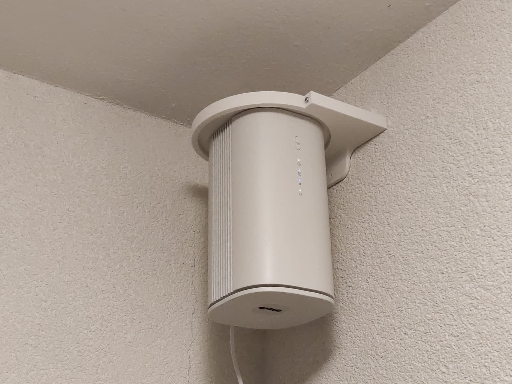
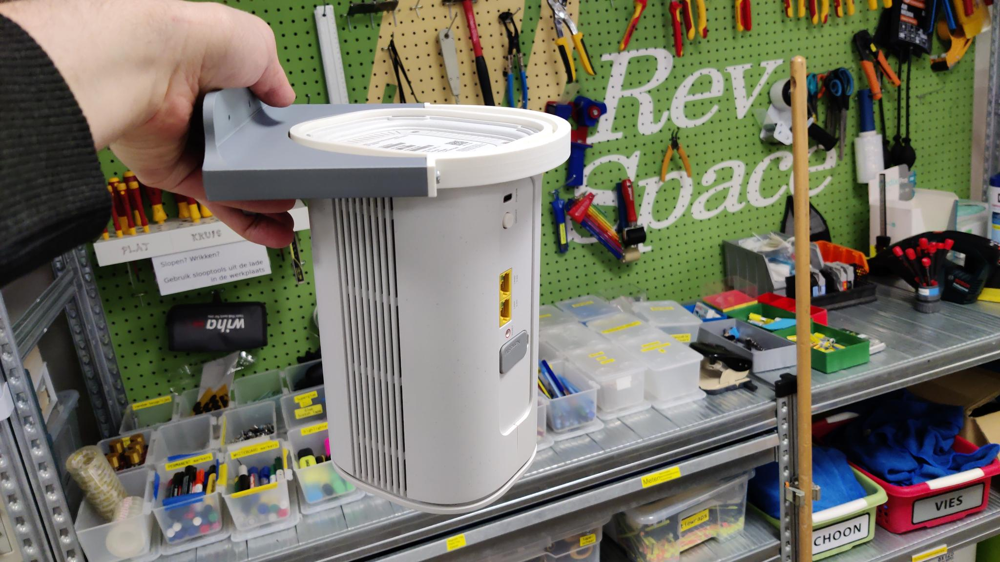

# klikenklaaraandemuur
Klik en Klaar modem muurbeugel. Je kunt hiermee het modem precies op de lokale zendmast richten.

Inmiddels zijn er minstens 3 exemplaren geprint en opgehangen :)

Ontworpen en geprint door mij, bij [Revspace](https://revspace.nl), Hackerspace Den Haag.

Andere prints (mocht je er ook eentje gemaakt hebben, laat het weten!):
* [Renetje6 op tweakers](https://gathering.tweakers.net/forum/view_message/80531656)

Als je een commerciële licentie op dit ontwerp wilt om meerdere beugels te kunnen verkopen, neem even contact op. 
